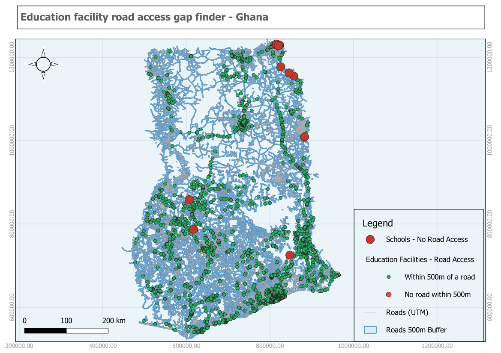

# Education Facility Road Access Gap Finder

**Country:** Ghana
**CRS:** EPSG:25000 - Leigon / Ghana Metre Grid
**Project file:** `Edu-Road-Access-Gap.qgz`

---

## Overview

This project identifies education facilities across Ghana that lack adequate road access. A 500 m buffer is applied to the road network to define a road-accessible corridor, and education facilities outside this corridor are flagged as having a road access gap. The output supports infrastructure prioritisation by locating schools that are physically isolated from the formal road network.

## Reference Layout

---

## Objectives

- Buffer the road network to define a 500 m road-accessible corridor.
- Tag all education facilities by whether they fall within or outside the corridor.
- Extract facilities with no road access within 500 m as the gap layer.
- Compute the nearest road distance for each facility.

## Methodology

1. Education facilities reprojected to EPSG:25000: `education_facilities_utm.gpkg`.
2. Roads reprojected to EPSG:25000: `roads_utm.gpkg`.
3. A 500 m buffer applied to the road network: `roads_500m_buffer.gpkg`.
4. Each education facility joined to the nearest road using a hub-distance or spatial join: `edu_nearest_road_join.gpkg`.
5. All facilities tagged with road access status: `edu_facilities_road_tagged.gpkg`.
6. Facilities outside the 500 m buffer extracted as the gap layer: `edu_facilities_no_road_access.gpkg`.

## Output Layers

| File | Description |
|------|-------------|
| `education_facilities_utm.gpkg` | Education facilities reprojected to EPSG:25000 |
| `roads_utm.gpkg` | Road network reprojected to EPSG:25000 |
| `roads_500m_buffer.gpkg` | 500 m buffer corridor along road network |
| `edu_nearest_road_join.gpkg` | Education facilities with nearest road distance attribute |
| `edu_facilities_road_tagged.gpkg` | All facilities tagged with road access status |
| `edu_facilities_no_road_access.gpkg` | Facilities with no road within 500 m (gap layer) |

## Key Findings

- A notable share of education facilities, concentrated in rural northern and interior regions, fall outside the 500 m road corridor.
- The gap layer maps directly onto areas of low road density identified in the Road Network Density Ranking project, confirming that infrastructure gaps compound across sectors.
- Facilities in the gap layer represent priority sites for either road construction or alternative access planning.

## Deliverables

| File | Type |
|------|------|
| `Edu-Road-Access-Gap.qgz` | QGIS project |
| `reference_layout.png` | Print layout reference image |

## Notes

- All layers use EPSG:25000 (Leigon / Ghana Metre Grid).
- The 500 m threshold represents a standard walkable access distance; this can be widened to 1 km or 2 km for rural contexts where road density is structurally lower.

---

## Map Preview

